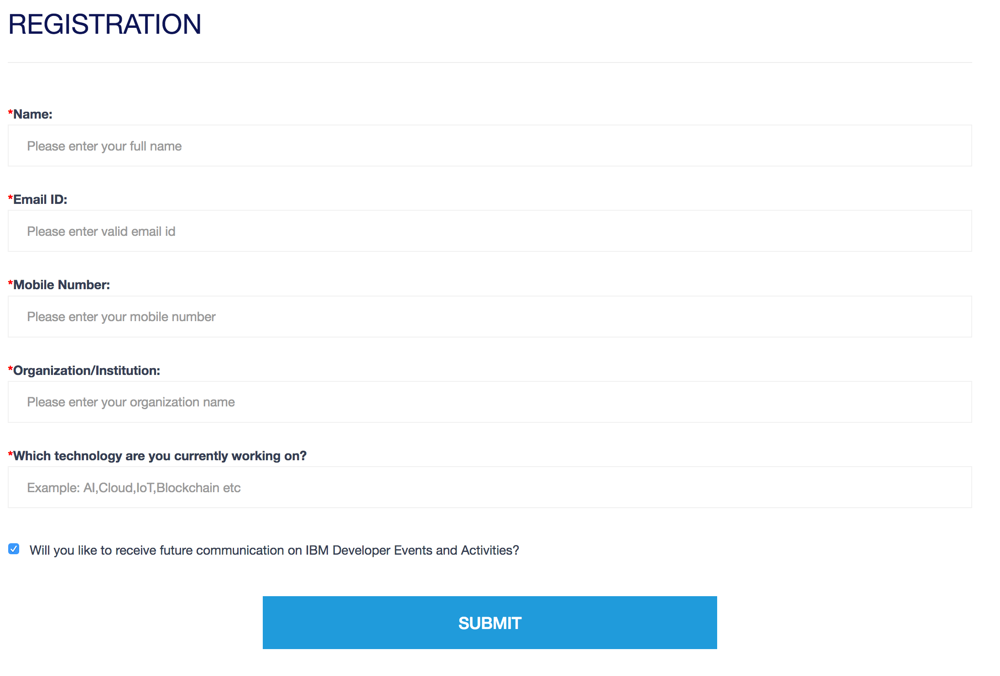

## Steps to deploy the application

Step 1: Create DB2 service on IBM Cloud

Step 2: Update the service credentials of your DB2 instance in .env file

Step 3: Update your Database Schema name,Table name and Column names in app.js file for both CREATE and INSERT command

To run on IBM Cloud:

Step 4: Login to IBM Cloud through IBM Cloud CLI and then push the application by executing the command--> ibmcloud cf push <app_name>

To run locally:

Step 4: Install all dependencies,run the command --> npm install

Step 5: Start the server by executing the command --> npm start

## Sample Output

